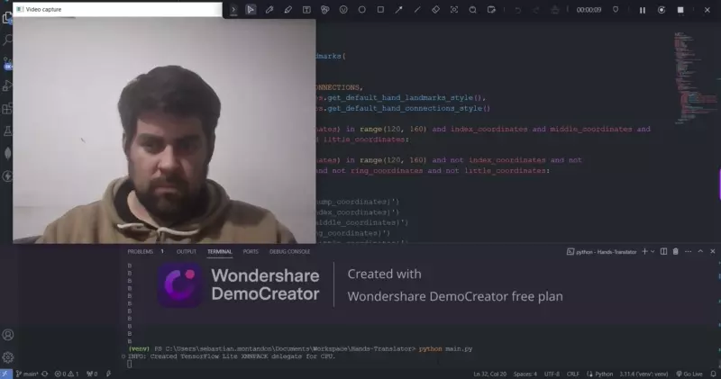

# Hands Lenguage Transaltor

Add a new project to practice with AI, in this case make this app to translate hand signs to words, on this version put 2 characters "A - B"

## 🚀 Look it in action



## 📜 Requirements

**Recommended**

```python
python -m venv venv
```

**Module needed**

```python
pip install mediapipe
```

---
*Please remember, this is just for practice, this not a production product*

---